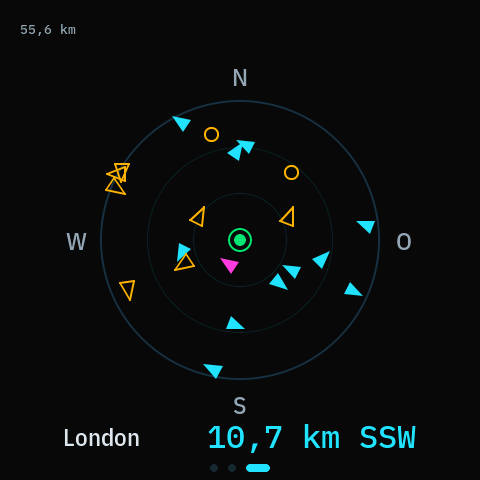
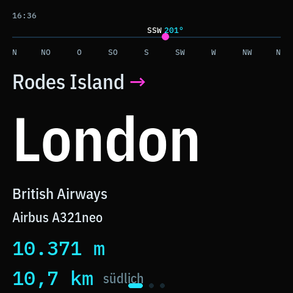
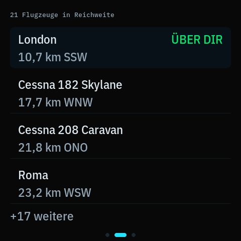
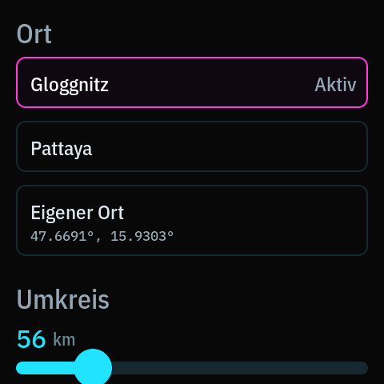
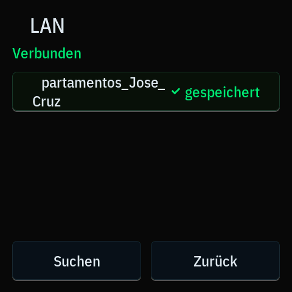

# Flugradar

A 4-inch panel that answers one question, in German:

> **Das Flugzeug da oben — wo fliegt es hin, wo kommt es her, und was ist es?**



Real traffic over Gloggnitz, Lower Austria. This is what the panel shows by itself, with
nobody touching it: where they are, which way they point, how many there are, north up,
and the nearest one named along the bottom edge. Every picture in this file is the panel's
own framebuffer read back over USB, not a mockup.

Tap one, and it answers in words:



An Austrian Airlines flight out of Vienna, 4.793 m up, 16,4 km to the north-east, on its
way to Bologna.

## Why it exists

It was built for one person: my father-in-law, who is Austrian, in his eighties, and not
technical. When he hears a plane he pulls out his phone and opens Flightradar24. This has
to be faster and easier than that, or there is no reason for it to exist.

So the whole design follows from two things he does. He **hears a plane and glances up** —
the scope is already showing him where it is and how many are up there, with nothing to
press. Or he **wants it in words** — and taps the aircraft.

That split is his own correction. It originally opened on the written answer and kept the
scope a swipe away, which is what the brief said to do. After living with it he asked for
the other way round, and he was right: the glance is served by the picture, and the tap
costs him nothing.

That is why the destination is the headline in 100 px type rather than a field in a table,
why it says "Airbus A321neo" and not `A21N`, and why the screen is never blank: an empty
panel reads as *broken* to someone who did not build it.

He splits the year between Gloggnitz, Vienna and Pattaya. One tap moves the device —
location, time zone, clock and all. He never sets a clock, because the timezone is bound to
the place rather than configured beside it.

## The screens

Two pages side by side, and the answer one layer underneath either of them.

| | |
|---|---|
|  |  |
| **Radar** — where they are and which way they point, north up. Magenta is the nearest, cyan has a filed route, amber does not. The marks are carried forward between polls, so they creep the way the aircraft does instead of jumping once every twelve seconds. | **Liste** — everything in range, nearest first, scrolling. Two lines a row: where it is going, then how far and in which direction — with the flight number and the model in the half of that line the distance was never using. |

Swipe between the two. Tap an aircraft on either one — or the caption along the bottom of
the radar — and **Über dir jetzt** opens underneath it: the same answer the device used to
open on, now one tap away instead of zero. **Zurück** sits in the top-left, and a tap
anywhere on the screen does the same thing, because a man in his eighties should not have
to find a button.

After 30 seconds of an untouched, empty sky the deck returns to the radar by itself. The
detail layer never closes on its own — if it is open, someone is reading it.

Aircraft with no filed route are not a failure case — seven of the thirteen in our first
live capture were light aircraft with no flight plan, and those are precisely the ones he
*hears*, low and slow over the house. They keep the layout and say why:

> **Eine Route gibt es nur zu Flügen mit Flugnummer.**

Settings are one screen: where he is, how far to look, how bright, and when to dim.

| | |
|---|---|
|  |  |

## Hardware

**Waveshare ESP32-S3-Touch-LCD-4B** — the "Smart 86 Box". ESP32-S3-WROOM-1-N16R8, 16 MB
flash, 8 MB octal PSRAM, a 480 × 480 ST7701 RGB565 panel and a GT911 touch controller, in
a standard 86-type wall-plate form factor (86.5 × 86.5 × 14 mm). Power is USB-C on the
side edge.

Built with **ESP-IDF 5.4**, the Waveshare BSP and **LVGL 9.6**, in C.

```
ls /dev/cu.usbmodem*          # the board re-enumerates; the node is not fixed
idf.py build
idf.py -p /dev/cu.usbmodem101 flash monitor
```

WiFi credentials are typed straight into the device over serial and stored in NVS. They
are never in this repository and never pass through a config file:

```
python3 tools/provision.py
```

## Standing it up

The board is a flush wall plate, which is the wrong shape for a table, so
[`hardware/desk_stand.scad`](hardware/desk_stand.scad) is a parametric wedge that holds it
at 20° off vertical — square to the sight line of someone seated about 70 cm away, which
is the same geometry the type sizes are set from. 95 × 55 mm footprint, one part, no
supports, with a notch so a right-angle USB-C plug leaves sideways instead of pushing the
stand off the table.

**It has not been printed, and its dimensions come from the datasheet rather than from
calipers on the unit in hand.** Render `part = "fittest"` first — it is the slot and the
lip alone, four minutes of filament, and it tells you whether the depth is right before
you commit to an hour.

## How it gets verified

The panel is the product, so the panel is what gets checked. `tools/grab_screen.py` pulls
the live framebuffer back over USB and writes it as a PNG — every screenshot above is the
real thing, read off the hardware, not a mockup. Every layout bug in `docs/DECISIONS.md`
was found that way, including several no host test could ever have seen.

Everything that can be tested off the device is:

```
cd test/host && make
```

Nine suites and two gates, **28,069 checks**, under ten seconds from a clean tree. Half of
that count is one exhaustive cross-product: all 13,824 combinations of hour, window start
and window end, with the updater's answer checked against the dimmer's own — two
implementations of one midnight wrap, in two translation units that cannot share code. If
they ever disagree the device dims at one hour and installs at another, and only one of
those is visible. The gates:

- **`check_font_coverage.py`** — LVGL draws a missing glyph as *nothing at all*. No error,
  no placeholder, just text that is shorter than you wrote. This fails the build if any
  string needs a character the generated font subset lacks.
- **`check_strings.py`** — every user-facing word lives in `main/strings_de.h`. This fails
  the build if one leaks into a widget constructor. `--list` prints the whole German
  vocabulary, grouped by screen, for reading aloud.

## Updating it remotely

It spends half the year 9,000 km away, so it can update itself — but only if you tell it
where from, and it leaves the workshop not knowing. Press `u` on the serial console and
paste the manifest URL:

```
https://github.com/MonsJovis/esp-flight-monitor/releases/latest/download/manifest.json
```

That is a GitHub release asset, which answers `302` every time; the device follows the
redirect itself. Behind it is the file each release publishes next to the image:

```json
{
  "version": "0.2.0",
  "url": "https://github.com/MonsJovis/esp-flight-monitor/releases/download/v0.2.0/esp-flight-monitor-0.2.0.bin",
  "size": 2428928
}
```

**Publishing one** is a tag. `.github/workflows/release.yml` runs the whole host suite,
builds with `PROJECT_VER` taken from the tag, signs the image, checks the finished binary
against the tag it is being published under, writes that manifest from the numbers it just
verified, and uploads both:

```bash
git tag v0.2.0 && git push origin v0.2.0
```

**Images are signed**, and the device checks. This is Secure Boot V2's signature scheme
without hardware secure boot: no fuses are burned and the bootloader is still replaceable
over USB, but a firmware image has to be signed by the same key that signed whatever is
already running, so controlling the URL is no longer enough to control the device. The
public half is in `tools/ota_signing_key.pub.pem`; the private half is in a GitHub Actions
secret and nowhere else.

That has one consequence if you build this yourself: **generate a key before your first
build**, because an unsigned build aborts on boot rather than failing to compile.

```bash
idf.py secure-generate-signing-key --version 2 --scheme rsa3072 secure_boot_signing_key.pem
```

A fresh key is fine — a panel you flash yourself will run your builds happily. It just
cannot update the one already in Austria, which is the point.

It checks about once a day and installs **only inside the night dim window**. That is a
precaution rather than a measurement: small NVS writes were measured on this unit and do
*not* tear the panel (espressif/esp-bsp#570 does not reproduce here), but a 2 MB image
write is a different workload and has never been run with anyone watching the screen. At
3 a.m. it costs nothing to assume the worse case.

A freshly written image boots on probation: it has to stay on WiFi for two minutes before
it confirms itself, and if it cannot, the bootloader puts the working build back. Plain
HTTP is refused — whoever controls that URL controls the device.

## Data

Positions come from **[adsb.lol](https://adsb.lol)**, routes from
**[adsb.im](https://adsb.im)**. Both are free, community-run, and this device is a polite
client: one position request every 12 seconds and never faster than 10, because rapid
requests earn a `429` and then a multi-minute `503`. Route lookups are batched — one POST
resolves every callsign on screen — and cached to NVS, so a route survives a reboot and is
never asked for twice. A route does not change mid-flight.

Place names, for setting where the device is standing, come from
**[Open-Meteo's geocoding API](https://open-meteo.com/en/docs/geocoding-api)** — one
request when somebody taps Suchen, and none otherwise. It was chosen over Nominatim and
Photon for a reason that looks like a detail and is not: it answers over plain HTTP, and
the other two redirect to HTTPS. This device carries no TLS on its data path because a
handshake wants about 40 KB of internal heap and the board has roughly 24 KB free. It also
returns each place's timezone, which is what lets the clock follow the location without
anyone setting one.

> Contains information from **adsb.lol**, which is made available under the
> [Open Database License (ODbL) v1.0](https://opendatacommons.org/licenses/odbl/1-0/).
> Any rights in individual contents of the database are licensed under the
> [Database Contents License](https://opendatacommons.org/licenses/dbcl/1-0/).
>
> Place data from **Open-Meteo**, derived from **[GeoNames](https://www.geonames.org/)**
> and made available under the
> [Creative Commons Attribution 4.0 licence](https://creativecommons.org/licenses/by/4.0/).

## Reading the repo

| | |
|---|---|
| [`AGENTS.md`](AGENTS.md) | The operating manual. Product intent, verified hardware profile, data architecture, the gotchas that cost a day each, and the three ways this repo has actually failed. |
| [`docs/DESIGN.md`](docs/DESIGN.md) | Colour semantics, type scale, screen inventory. Read before building any screen. |
| [`docs/PLAN.md`](docs/PLAN.md) | Milestones M0–M8 and where the build actually is. |
| [`docs/DECISIONS.md`](docs/DECISIONS.md) | Every decision and why, including the ones that turned out to be wrong. |
| [`docs/RESEARCH.md`](docs/RESEARCH.md) | Survey of the existing open-source flight radars, and what was worth taking. |

The colour vocabulary is borrowed from aviation, not chosen for looks: magenta is the
active route, green is normal, amber is a missing value, and no colour ever carries
meaning on its own — that is FAA AC 25-11A and RTCA DO-257A, and they were written by
people who had already learned what happens when a glance goes wrong.
